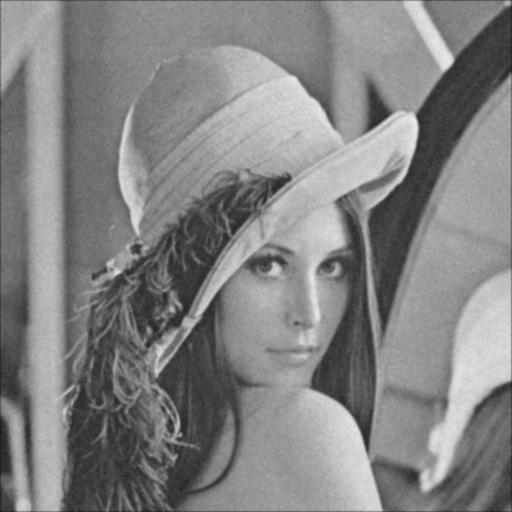
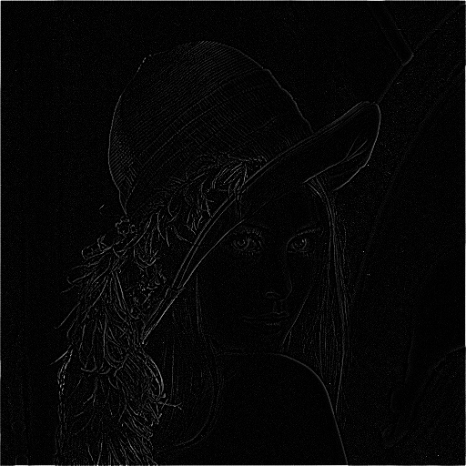
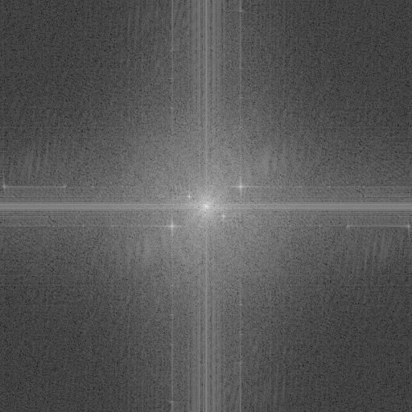
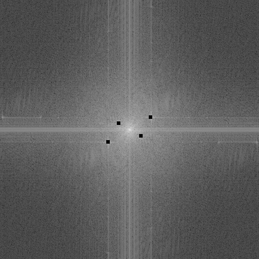

# 🧠 ImageSignalFiltering – Spatial & Frequency Domain Filtering in Python

**ImageSignalFiltering** is a Python-based project that explores filtering techniques in both the **spatial** and **frequency** domains. It includes manual implementations of the Discrete Fourier Transform (DFT), spatial filters like Gaussian and Laplacian, and advanced frequency-domain noise removal using DFT masking.

---

## 🔧 Features

### 1️⃣ Discrete Fourier Transform (DFT)
- Implements:
  - Forward DFT from scratch (15×15 matrix)
  - Magnitude computation
  - Inverse DFT reconstruction
- Uses only `math` functions (e.g. `sin`, `cos`)

### 2️⃣ Spatial Filtering
- **5×5 Gaussian Filter**
  - Smooths images and reduces noise
- **3×3 Laplacian Filter**
  - Enhances edges and detects detail
- All convolution is implemented manually

### 3️⃣ Frequency Filtering
- Removes periodic noise using DFT masking
- Steps:
  - Compute DFT
  - Visualize and identify noise frequencies
  - Apply frequency mask
  - Inverse transform to reconstruct clean image
- Uses `numpy.fft` for performance in this part only

---

## 📂 Project Structure

```
ImageSignalFiltering/
├── spatial_filtering/
│   └── filtering.py              # Gaussian and Laplacian filters
├── frequency_filtering/
│   ├── dft.py                    # Manual DFT, inverse DFT, magnitude
│   └── filtering.py              # Periodic noise masking in frequency domain
├── output/                       # Output images
│   ├── clown_dft.jpg
│   ├── clown_dft_filtered.jpg
│   ├── clown_filtered_image.jpg
│   ├── lenna_gaussian.jpg
│   ├── lenna_laplacian.jpg
│   └── ...
├── run_dft.py                    # Runs manual DFT implementation
├── run_spatial_filter.py         # Applies Gaussian + Laplacian filters
├── run_freq_filter.py            # Executes frequency filtering with DFT
├── dip.py
├── Lenna_with_noise.jpg
├── Image_with_periodic_noise.png
├── requirements.txt
└── README.md
```

---

## 📸 Example Output

| Operation            | Output Example                        |
|----------------------|----------------------------------------|
| Gaussian Filter       |  |
| Laplacian Filter      |  |
| DFT Magnitude         |  |
| Filtered DFT          |  |
| Final Cleaned Image   |  |

---

## ▶️ How to Run

```bash
# Run manual DFT, inverse DFT, and magnitude
python run_dft.py

# Apply Gaussian and Laplacian spatial filters
python run_spatial_filter.py

# Perform frequency-domain noise removal
python run_freq_filter.py
```

All output files are saved to the `output/` directory automatically.

---

## ✅ Tech Stack

- Python 3
- No third-party image processing libraries in DFT or spatial filters
- `numpy.fft` used only for frequency filtering
- Core modules: `math`, `argparse`, `os`

---

## 💡 What It Demonstrates

- Understanding of both spatial and spectral (frequency) domain image processing
- Manual construction of DFT and filtering masks
- Edge detection and noise reduction techniques
- Real-world denoising using signal processing principles
